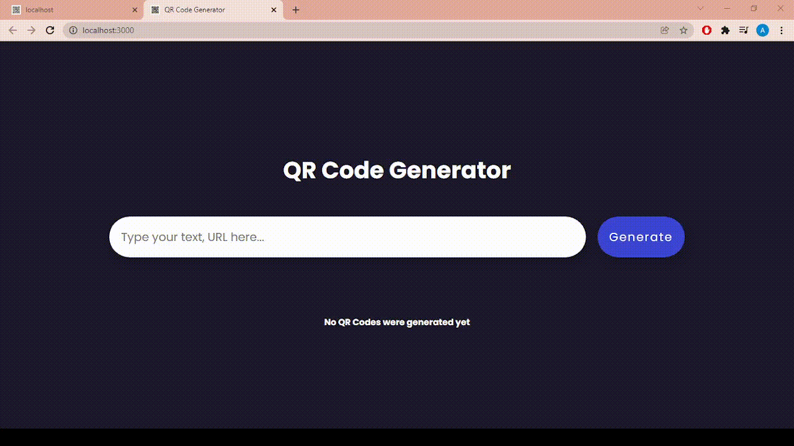
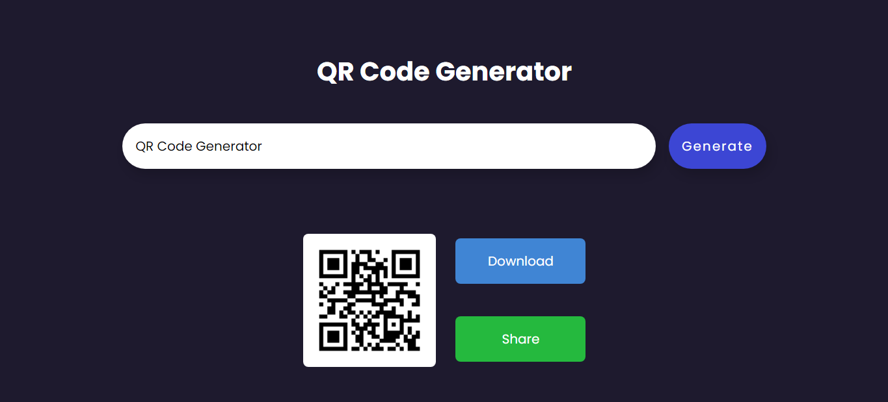
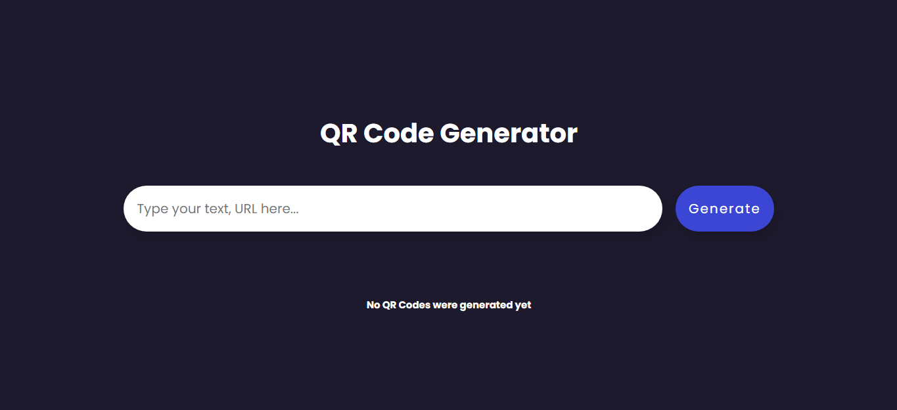
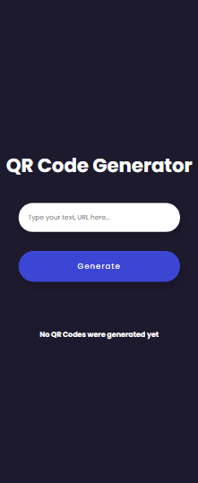
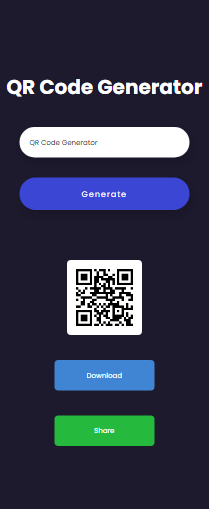

<h1 align="center">
    
</h1>

# ✉ About

A completely responsive website where you can create a QR Code for texts and links.

# 🌆 GIFs and images

## GIF


# Desktop Screenshots

<div>
    
    
</div>

# Mobile Screenshots

<div>
    
    
</div>

# 👨‍💻👩‍💻 Use the app

You can access the application by clicking on the link below:

[Access QR Code Generator](https://qrcode-generator-al.vercel.app)

# 💻 Technologies used in this project

- HTML 
- CSS
- JavaScript
- ReactJS
- NodeJS
- Express
- qrcode (package from npm)
- React Hot Toast (package from npm)

# ❓ How to use it

```bash

git clone https://github.com/arthur-lage/qrcode-generator.git

cd qrcode-generator

npm start

```
